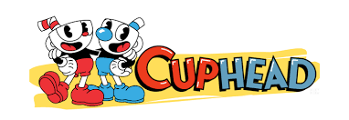

# CC_II__videogame
# Cup Head Free to Play

Bienvenido al repositorio del proyecto "Cup Head Free to Play". Este videojuego es parte del curso de Ciencia de la Computación II y está inspirado en el popular juego "Cuphead". El objetivo del juego es esquivar monstruos y derrotar jefes a lo largo de varios niveles emocionantes.

## Descripción del Juego

El presente proyecto de programación tiene como objetivo desarrollar un apasionante juego multijugador, inspirado en el estilo y la mecánica del reconocido juego 'Cuphead'. Este juego ofrece una experiencia emocionante y desafiante para los jugadores, permitiéndoles enfrentarse en 
equipos mientras se sumergen en un mundo lleno de acción y aventura.
El enfoque principal de este proyecto radica en la implementación de una experiencia de juego multijugador envolvente. Los jugadores podrán conectarse y competir entre sí en un entorno cooperativo, permitiendo así la interacción y la diversión compartida. La comunicación y la estrategia 
en equipo serán elementos clave para alcanzar la victoria en las batallas llenas de acción y obstáculos desafiantes.

### Beelevel
En este nivel, los jugadores deben esquivar una serie de monstruos y superar obstáculos en diferentes plataformas. La agilidad y los reflejos serán clave para sobrevivir y avanzar.

### Flor Level
Este es el nivel de jefe del juego. Aquí, los jugadores se enfrentarán a una desafiante batalla contra una flor. Para derrotarla, los jugadores deberán utilizar diferentes tipos de balas de cada personaje de Cuphead, cada una con sus propias características y habilidades.

## Arquitectura

La implementación de este proyecto se basa en una arquitectura sólida y flexible, siguiendo el patrón Modelo-Vista-Controlador (MVC). Esto permitirá una organización estructurada del código, así como la adaptabilidad y escalabilidad del juego a medida que se agreguen nuevas 
funcionalidades y características en el futuro.

## Ramas en el Repositorio

El repositorio se organiza en cuatro ramas principales:

- **master**: Rama principal protegida que contiene la versión estable y funcional del juego.
- **Arleen**: Rama de desarrollo propiedad de Arleen Maritza Ferro Vásquez.
- **cdho**: Rama de desarrollo propiedad de Cristhian David Huanca Olazabal.
- **jazz**: Rama de desarrollo propiedad de Jazmin Gabriela Perez Villasante.
  
## Requisitos y Dependencias

Para poder ejecutar y trabajar en el proyecto, asegúrate de tener las siguientes dependencias instaladas:

- SFML (todas las librerias estan puestas en el repositorio, basta con clonarlo y modificar los includePath)

## Contacto

 - Ferro Vásquez, Arleen Maritza <aferro@unsa.edu.pe>
 - Huanca Olazabal, Cristhian David <chuancao@unsa.edu.pe>
 - Pérez Villasante, Jazmín Gabriela <jperezvi@unsa.edu.pe>
